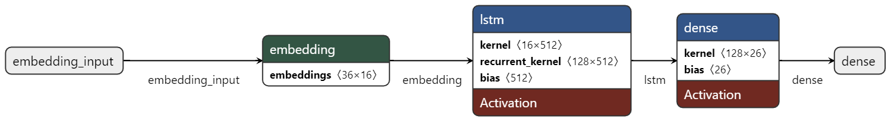
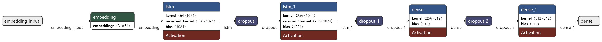

# Deep Decrypt
Die Open-Source Daten für das Jugend-forscht Projekt "Deep-Decrypt".

## Installation der Python-Umgebung

Die verwendete Python-Version ist 3.7.9. Ich verwende eine virtuelle Python-Umgebung, so dass ich verschiedene Paketversionen in meinem gesamten System verwenden kann.
Sie können auch eine virtuelle Umgebung (venv) mit `pyhton 3.7 -m venv .venv` erstellen.
Nachdem es fertig ist, kann man es mit dem Befehl `.venv/Scripts/activate` aktivieren (Wenn Sie Windows oder MacOS benutzen, versuchen Sie andere Aktivierungsdateien in .venv/Scripts).

Ich aktualisiere gerne den Paketmanager, nachdem ich das venv zum ersten Mal eingerichtet habe. Um dies zu tun, führen Sie `python -m pip install --upgrade pip` aus, damit wir den neuesten Paketmanager für Python haben.

Nachdem der neue Paketmanager installiert ist, können Sie damit beginnen, einige Abhängigkeiten zu installieren.

- Tensorflow - `pip install tensorflow`
- Scikit learn - `pip install scikit-learn`
- ttkbootstrap - `pip install ttkbootstrap`

Alles in einem: `pip install tensorflow scikit-learn ttkbootstrap`

# Hinter den Kulissen

Die einzelnen Modelle für den Affine und Caesar Chiffre sind unterschiedlich aufgebaut, um der Komplexität der Verschlüsselungsmethode gerecht zu werden.

*Caesar Cipher ist einfach aufgebaut und besteht aus:*
- **Eingabeschicht**: Nimmt den Klartext als Eingabe entgegen.
- **Embedding-Schicht**: Wandelt die Buchstaben in numerische Vektoren um, die die Bedeutung der Buchstaben darstellen.
- **LSTM-Schicht**: Eine Art von neuronalem Netzwerk, das sich gut für die Verarbeitung sequenzieller Daten wie Text eignet. Es lernt Muster und Beziehungen zwischen den Buchstaben im Text.
-  **Dense-Schicht**: Eine voll verbundene Schicht, die die Ausgabe der LSTM-Schicht in die verschlüsselten Buchstaben umwandelt.

*Im Gegensatz dazu ist die affine Chiffre komplexer und verwendet ein paar mehr Schichten:*
- **Eingabe-Schicht**: Nimmt den Klartext als Eingabe entgegen.
- **Embedding-Schicht**: Wandelt die Buchstaben in numerische Vektoren um.
- **LSTM-Schicht**: Lernt Muster und Beziehungen zwischen den Buchstaben.
- **Dropout**: Eine Technik zur Regularisierung, die Neuronen während des Trainings zufällig deaktiviert, um eine Überanpassung zu vermeiden.
- **LSTM-Schicht (zweite)**: Eine weitere LSTM-Schicht, um komplexere Muster im Text zu lernen.
- **Dropout (zweite)**: Eine weitere Dropout-Schicht zur Regularisierung.
- **Dense-Schicht**: Wandelt die Ausgabe der LSTM-Schichten in verschlüsselte Buchstaben um.
- **Dropout (dritte)**: Eine letzte Dropout-Schicht zur Regularisierung.
- **Dense-Schicht (letzte)**: Die endgültige Schicht, die die Ausgabe in die endgültigen verschlüsselten Buchstaben umwandelt.
